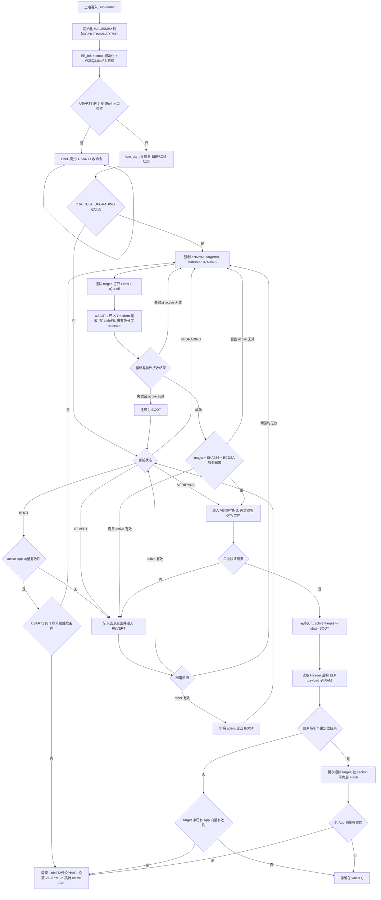

# STM32 OTA Bootloader 项目复现与技术文档

## 1. 文档说明

本文档用于介绍、复现和总结当前 STM32 OTA Bootloader 项目。文档依据两类材料整理：

- 当前工程源码：`C:\Users\zyw\Desktop\OTA\test`
- 项目历程笔记：`C:\Users\zyw\Desktop\docs-ota\zhangyuwei\零散\未命名 2.md`

本文档中的“版本”不是正式发布版本号，而是项目实现过程中的阶段划分。阶段划分遵循项目实际推进路径，避免将每一个功能模块都拆成独立版本。整体技术路线为：

```text
单分区 Bootloader -> Xmodem/Ymodem 传输 -> A/B 分区与状态机
-> 安全校验与 Shell 调试 -> LittleFS 与 ELF 重定位
```

文档目标包括：

- 说明硬件资源和工程结构
- 说明项目目标和应用场景
- 按项目阶段解释模块功能和核心代码
- 记录方案选择依据、优势和问题处理
- 提供复现步骤、优化方向和对外介绍口径

本文采用以下事实口径，避免将项目历程、当前源码和已验证结果混为一谈：

| 标记 | 含义 | 使用方式 |
| --- | --- | --- |
| 历程记录 | 来自项目推进笔记的阶段性设计 | 用于说明当时的思考、取舍和问题来源 |
| 当前源码 | 当前工作区中的实际实现 | 用于解释现有接口、数据结构和运行路径 |
| 当前构建 | Keil 工程、map 文件和最近一次构建产物反映的状态 | 用于核对地址、容量、编译宏和资源占用 |
| 待实测 | 源码中已有设计，但本文未取得完整硬件日志或断电测试记录 | 不表述为已经完成闭环验证 |

文中的核心代码均直接嵌入正文。为突出机制，部分片段省略了日志和重复的错误分支，但保留实际函数名、关键变量和控制顺序；凡涉及当前限制的地方，以“当前实现边界”单独说明。

## 2. 硬件平台与资源

### 2.1 主控平台

本项目基于 `STM32L431RCTx`，工程配置为 `LQFP64` 封装。当前时钟树使用 MSI 经 PLL 倍频，`SYSCLK/HCLK` 均为 `80 MHz`。与本项目直接相关的资源如下：

| 资源 | 当前配置 | 对项目的影响 |
| --- | --- | --- |
| CPU | Arm Cortex-M4F | 执行 Bootloader、密码算法和 ELF 重定位 |
| 内部 Flash | `256 KB`，`0x08000000 ~ 0x0803FFFF` | 承载 Bootloader、两个 App 槽和 EEPROM 仿真区 |
| SRAM1 | `48 KB`，`0x20000000 ~ 0x2000BFFF` | 放置主要全局变量、LittleFS 缓冲和 `elf_buf` |
| SRAM2 | `16 KB`，`0x10000000 ~ 0x10003FFF` | 当前链接器继续放置剩余 RW/ZI、堆和栈 |
| Flash 擦除粒度 | `2 KB/Page` | 决定 App 分区和 EEPROM 页必须按 Page 对齐 |
| Flash 编程粒度 | `8 B/Doubleword` | 决定尾字节缓存与 `0xFF` 补齐策略 |
| 当前系统时钟 | `80 MHz` | USART、SPI、超时和处理性能均以此配置为基准 |

在本项目中，硬件资源直接影响软件架构：

- 内部 Flash 决定 Bootloader、App A、App B 和 EEPROM 仿真区的划分。
- UART 决定上位机与 MCU 的固件传输和调试方式。
- SPI 决定外部 W25Qxx Flash 的访问能力。
- RAM 大小决定 OTA 文件和 ELF 解析缓冲区的设计。
- Cortex-M 向量表机制决定 Bootloader 跳转 App 时的 VTOR、MSP 和中断处理方式。

### 2.2 外设资源

根据 `test.ioc` 和 `Core/Src/usart.c`，当前工程使用的主要外设如下：

| 硬件资源 | 引脚 / 配置 | 当前作用 |
| --- | --- | --- |
| `USART1` | `PA9` TX，`PA10` RX，115200 | Shell 命令输入、Xmodem/Ymodem 数据传输 |
| `USART3` | `PC4` TX，`PC5` RX，115200 | `printf` 日志输出、启动阶段进入 Shell 的按键检测 |
| `SPI1` | `PA5` SCK，`PA6` MISO，`PA7` MOSI，约 10 Mbit/s | 驱动外部 W25Qxx Nor Flash |
| W25Qxx CS | `PA4` | 外部 SPI Flash 片选 |
| DMA | `DMA1_Channel5`，`USART1_RX` | CubeMX 已配置；当前 X/Ymodem 主路径仍使用阻塞接收，Shell 使用单字节中断接收 |
| 内部 Flash | `0x08000000` 起始 | 存放 Bootloader、App 分区和 EEPROM 仿真区 |
| 外部 Flash | 当前 LittleFS 参数按 W25Q32 的 `4 MB` 容量配置 | LittleFS 文件系统，保存 OTA 文件 |
| 状态 GPIO | `PC9`，标签 `R` | 已配置为推挽输出，当前业务流程尚未使用 |

当前工程中 `USART3` 主要承担日志输出，`USART1` 主要承担命令和升级数据传输。复现时建议准备两路串口，或在操作前明确当前串口连接对象。

W25Q32 与 MCU 的复现连接关系如下：

| W25Q32 信号 | MCU 引脚 | 说明 |
| --- | --- | --- |
| `CS` | `PA4` | 软件控制片选 |
| `CLK` | `PA5/SPI1_SCK` | SPI 时钟 |
| `DO` | `PA6/SPI1_MISO` | Flash 到 MCU |
| `DI` | `PA7/SPI1_MOSI` | MCU 到 Flash |
| `/WP` | 上拉到 `3.3 V` | 未使用硬件写保护时保持高电平；裸芯片建议约 10 kOhm 上拉 |
| `/HOLD` | 上拉到 `3.3 V` | 未使用暂停功能时保持高电平；裸芯片建议约 10 kOhm 上拉 |
| `VCC/GND` | `3.3 V/GND` | 必须与 MCU 共地，禁止接入 5 V 逻辑 |

若更换为其他容量的 W25Qxx，除了 JEDEC 驱动识别外，还必须同步修改 `LFS_BLOCK_COUNT`。当前 `4096 B * 1024` 的配置只覆盖 `4 MB`。

首次烧录至少连接 ST-Link 的 `SWDIO/PA13`、`SWCLK/PA14`、`NRST`、目标电压参考和 GND。裸 W25Q32 电源附近还应放置去耦电容；若使用成品模块，应确认模块已经包含上拉和去耦。

### 2.3 分区设计与当前构建一致性

当前业务源码中的分区常量如下：

```c
#define FLASH_BASE_ADDR          0x08000000U
#define FLASH_TOTAL_SIZE         (256U * 1024U)

#define BOOT_START_ADDR          0x08000000U
#define BOOT_SIZE                (48U * 1024U)

#define APP_A_START_ADDR         0x0800C000U
#define APP_A_SIZE               (80U * 1024U)

#define APP_B_START_ADDR         0x08020000U
#define APP_B_SIZE               (124U * 1024U)

#define EEPROM_START_ADDR        0x0803F000U
```

这些常量表达的逻辑分区如下：

| 分区 | 起始地址 | 大小 | 作用 |
| --- | --- | --- | --- |
| Bootloader | `0x08000000` | `48 KB` | 启动控制、升级、校验、装载、跳转 |
| App A | `0x0800C000` | `80 KB` | A 应用槽 |
| App B | `0x08020000` | `124 KB` | B 应用槽 |
| EEPROM 仿真区 | `0x0803F000` | `4 KB` | 保存 OTA 状态、活动槽、目标槽、回退原因 |

项目历程笔记中曾记录过早期分区方案：Bootloader `96 KB`，A/B 区各 `78 KB`，EEPROM `4 KB`。这属于项目推进中的阶段性方案，不能与当前源码常量混用。

当前 Keil 链接配置与上述逻辑分区尚未统一。自动生成的 scatter 文件实际允许 Bootloader 使用 `0x19000`，即 `100 KB`：

```text
LR_IROM1 0x08000000 0x00019000
ER_IROM1 0x08000000 0x00019000
```

最近一次构建的 map 文件显示：

| 项目 | 实测值 |
| --- | --- |
| Bootloader ROM 占用 | `99,736 B`，约 `97.40 KB` |
| Bootloader Load Region 结束地址（半开区间） | `0x080186EC`，已超过 `0x08018000` |
| Keil IROM 上限 | `0x08019000` |
| 逻辑 App A 起点 | `0x0800C000` |

因此，当前 Bootloader 映像与逻辑 App A 区存在地址重叠。若直接擦除或写入 App A，可能同时破坏仍在执行的 Bootloader 代码。该问题属于复现前必须消除的配置冲突，不能仅依赖 `global.h` 中的分区表判断安全性。

可采用的收敛方案如下：

| 方案 | 分区处理 | 适用条件 | 取舍 |
| --- | --- | --- | --- |
| 压缩 Bootloader | 将 Bootloader ROM 控制在 `48 KB` 内，并把 Keil IROM 长度改为 `0xC000` | 能裁剪密码库、Shell、LittleFS 或 ELF 功能 | 保留当前 A/B 容量，但对现有约 `97.4 KB` 映像不现实 |
| 重划内部 Flash | Bootloader `100 KB`，A/B 各 `76 KB`，EEPROM `4 KB` | App 映像可稳定控制在 `76 KB` 内 | 与当前 Bootloader 大小更接近，但余量仍较小 |

第二种方案的候选地址为：

| 分区 | 候选起始地址 | 候选大小 |
| --- | --- | --- |
| Bootloader | `0x08000000` | `100 KB` (`0x19000`) |
| App A | `0x08019000` | `76 KB` (`0x13000`) |
| App B | `0x0802C000` | `76 KB` (`0x13000`) |
| EEPROM | `0x0803F000` | `4 KB` |

该候选表仅用于说明一种一致的划分方式，当前源码尚未应用。正式复现时必须一次性同步四处配置：Bootloader 链接区、`global.h`、两个 App 的链接地址/基地址约定，以及擦除写入边界。

### 2.4 当前 ROM 与 RAM 预算

当前 Keil 工程使用 Arm Compiler 5.06 update 3。最近一次构建为 `0 Error(s), 5 Warning(s)`，资源占用如下：

| 区域 | 已用 | 可用 | 占用情况 |
| --- | --- | --- | --- |
| ROM | `99,736 B` | 当前链接上限 `102,400 B` | 约 `97.4%`，余量约 `2.6 KB` |
| SRAM1 | `47,636 B` | `49,152 B` | 约 `96.9%` |
| SRAM2 | `14,872 B` | `16,384 B` | 约 `90.8%` |
| 总 RAM | `62,508 B` | `65,536 B` | 约 `95.4%` |

RAM 的主要大对象包括 `elf_buf[40 KB]`、ECDSA 工作区 `ecc_buf[4 KB]`、LittleFS 缓冲、`4 KB` 堆和 `4 KB` 栈。当前工程已经处于高水位，新增协议缓存、日志或密码算法前应先检查 map 文件，不能只以“编译通过”判断资源安全。

## 3. 项目目标与应用场景

### 3.1 项目目标

本项目的目标是实现一个可靠、可回退、可验证的 STM32 OTA Bootloader。它不仅完成固件写入，还围绕升级失败后的恢复能力、安全校验和后期维护进行设计。

总体设计目标及当前状态如下：

| 能力 | 当前状态 |
| --- | --- |
| Bootloader 接管启动、清理资源并跳转 App | 当前源码已实现 |
| 串口固件接收 | Xmodem/Xmodem-1K 主路径已实现；Ymodem 分支仍有兼容边界 |
| A/B 双分区与失败回退 | 状态机逻辑已实现；分区冲突和 App 启动确认尚需收敛 |
| Flash 模拟 EEPROM | 两页追加日志、GC 和上电恢复已实现 |
| 固件安全校验 | magic、SHA256、ECDSA 已强制；长度、版本和防回滚尚未生效 |
| W25Q32 + LittleFS 暂存 | 驱动、挂载、格式化和文件写入路径已实现，硬件日志待补 |
| ELF 解析和重定位 | REL/值域双路径已实现；容量、RELA 和黄金样例测试待完善 |
| Shell 调试 | 命令解析、环形缓冲和常用诊断命令已实现；历史 OTA 命令待统一 |

### 3.2 应用场景

当前已接入的升级传输介质是 UART，严格来说属于本地 IAP/串口升级链路；WiFi BSP 仍为占位实现，尚未形成真正的远程无线下载。本文继续沿用项目名称“OTA Bootloader”，是因为 A/B、验签、状态恢复、暂存和装载机制可复用于后续网络 OTA，但对外介绍时应明确当前传输边界。

该项目适用于以下场景：

- 工业控制设备现场升级
- 低功耗终端固件维护
- 传感器节点批量更新
- 嵌入式课程设计或毕业设计
- Bootloader、OTA、安全升级方向的技术展示
- 后续扩展 WiFi OTA 或设备远程维护平台

## 4. 技术路线总览

### 4.1 阶段划分

根据项目历程，本文将项目划分为五个阶段：

| 阶段 | 版本名称 | 解决的核心问题 |
| --- | --- | --- |
| 第一阶段 | 单分区 Bootloader 基础版 | 接收 bin、写 Flash、校验数据、跳转 App |
| 第二阶段 | Xmodem/Ymodem 标准传输版 | 标准化串口分包、校验、重传和尾包处理 |
| 第三阶段 | A/B 分区与状态机版 | 双区升级、失败回退、掉电状态保存 |
| 第四阶段 | 安全校验与 Shell 调试版 | 固件完整性、来源可信性和现场调试 |
| 第五阶段 | LittleFS + ELF 重定位版 | 一份固件适配两个 App 分区 |

该路线反映了项目从功能验证到工程化实现的推进过程：基础 Bootloader 先验证可行性，传输协议提高数据可靠性，A/B 与 EEPROM 提升升级恢复能力，签名校验提高安全性，ELF 重定位解决双区运行中的链接地址问题。

### 4.2 当前模块协作关系

| 模块 | 主要职责 | 与其他模块的边界 |
| --- | --- | --- |
| 启动入口 | 初始化时钟、外设、cmox、EEPROM 和 LittleFS，组装上下文 | 只负责资源准备和选择 Shell/OTA 入口 |
| Xmodem/Ymodem | 握手、分帧、CRC、ACK/NAK、重传、EOT 和尾包 | 通过写回调交付数据，不直接依赖具体存储介质 |
| LittleFS/存储回调 | 把协议数据写入外部 W25Q32 文件 | 不负责固件可信性和内部 Flash 装载 |
| EEPROM 仿真 | 追加写配置、页 GC、掉电恢复 | 对上只暴露虚拟地址读写，不理解 OTA 业务 |
| OTA 状态机 | 管理 active/target、升级、验证和回退 | 通过回调调用传输，通过统一接口读写 EEPROM |
| 固件验证 | 解析固定包头、计算 SHA256、执行 ECDSA 验签 | 只判断外部文件可信性，不负责地址重定位 |
| ELF 加载器 | 解析 section/REL、重定位绝对引用、计算入口 | 通过 I/O 回调读取和回写，不负责串口协议 |
| Flash/跳转 | 擦写目标区、检查向量、清理资源、设置 VTOR/MSP | 是进入 App 前的最后执行层 |
| Shell | 提供状态查询、配置和文件传输入口 | 部分历史 OTA 命令仍需与主状态机统一 |
| WiFi BSP | 预留网络扩展接口 | 当前为占位实现，不属于已完成 OTA 链路 |

这一分层的核心价值是把传输、存储、验证和装载拆开，使后续替换串口为网络或替换 LittleFS 为其他介质时，不需要重写整个 OTA 状态机。

## 5. 第一阶段：单分区 Bootloader 基础版

### 5.1 阶段目标

第一阶段的目标是跑通 Bootloader 基础闭环：

```text
上位机发送 bin -> MCU 接收 -> 写入内部 Flash -> 校验 -> 跳转 App
```

这一阶段重点解决：

- bin 文件前两个字的含义
- 链接地址、烧录地址和复位向量的关系
- STM32 内部 Flash 擦除与写入
- Flash 8 字节对齐问题
- UART 中断接收与主循环写 Flash 的分工
- CRC 校验
- Bootloader 跳转 App
- App 中 VTOR 和全局中断处理

STM32 复位后可根据启动配置从用户 Flash、系统存储器或 SRAM 取得启动向量。本项目选择从用户 Flash 启动，自定义 Bootloader 位于 `0x08000000`。Cortex-M 内核首先读取向量表第 0 项作为 MSP，再读取第 1 项作为带 Thumb bit 的 Reset_Handler；因此 App 的链接地址、实际写入地址和向量表基址必须保持一致，或由后续重定位机制统一修正。

### 5.2 方案选择依据

第一阶段的方案选择围绕“先建立最短可运行闭环”展开：

| 方法 | 思路 | 取舍 |
| --- | --- | --- |
| 整包缓存后写入 | 在 RAM 中保存完整 bin，再统一擦写 | 逻辑简单，但固件大小超过可用 RAM 后不可行 |
| 分段接收、分段写入 | 每次只保存一个接收块，并持续推进 Flash 地址 | RAM 占用稳定，但必须处理跨包 8 字节对齐和尾包结束判断 |
| 在中断中直接写 Flash | 接收完成后立即执行擦写 | 响应路径直观，但 Flash 操作耗时会阻塞接收并造成丢字节 |
| 中断只置标志，主循环写入 | ISR 只交付数据，耗时操作移出中断 | 并发边界清晰，是本阶段采用的实现方式 |

早期方案采用 DMA + 中断接收上位机发送的 bin 文件，并采用分段接收、分段写入 Flash 的方式。上位机包间隔同时承担处理时间窗和尾包超时判断。该方案能够快速验证 Bootloader 的核心机制，但传输格式尚未标准化、单分区没有回退能力，CRC 也只能发现传输错误，不能证明固件来源。

### 5.3 核心代码：Flash 写入尾字节处理

STM32L4 内部 Flash 写入要求按 doubleword 编程，即 8 字节对齐。当前代码通过 `s_tail_bytes` 和 `s_tail_len` 暂存不足 8 字节的尾部数据：

```c
static uint8_t s_tail_bytes[8] = {0};
static uint8_t s_tail_len      = 0U;

HAL_StatusTypeDef Write_Buffer_To_Flash(uint32_t *startaddr,
                                        const uint8_t *buffer,
                                        uint32_t size)
{
    HAL_StatusTypeDef status = HAL_OK;
    uint64_t value = 0U;
    uint32_t idx = 0U;

    HAL_FLASH_Unlock();

    if (s_tail_len > 0U) {
        uint32_t need = 8U - s_tail_len;
        uint32_t copy_len = (size < need) ? size : need;

        memcpy(&s_tail_bytes[s_tail_len], buffer, copy_len);
        s_tail_len += (uint8_t)copy_len;
        idx += copy_len;

        if (s_tail_len == 8U) {
            memcpy(&value, s_tail_bytes, 8U);
            status = HAL_FLASH_Program(FLASH_TYPEPROGRAM_DOUBLEWORD,
                                       *startaddr, value);
            if (status != HAL_OK) {
                HAL_FLASH_Lock();
                return status;
            }
            *startaddr += 8U;
            s_tail_len = 0U;
        }

        if (idx >= size) {
            HAL_FLASH_Lock();
            return HAL_OK;
        }
    }

    for (; (idx + 8U) <= size; idx += 8U) {
        memcpy(&value, buffer + idx, 8U);
        status = HAL_FLASH_Program(FLASH_TYPEPROGRAM_DOUBLEWORD,
                                   *startaddr, value);
        if (status != HAL_OK) {
            HAL_FLASH_Lock();
            return status;
        }
        *startaddr += 8U;
    }

    if (idx < size) {
        uint32_t remain = size - idx;
        memcpy(s_tail_bytes, buffer + idx, remain);
        s_tail_len = (uint8_t)remain;
    }

    HAL_FLASH_Lock();
    return HAL_OK;
}
```

代码分析：

- `s_tail_len > 0` 表示上一包留下了不足 8 字节的数据。
- 当前包先补齐上一包尾部，凑满 8 字节后写入 Flash。
- 当前包剩余数据按 8 字节循环写入。
- 当前包末尾再次不足 8 字节时，继续暂存到 `s_tail_bytes`。

最后一包写入时使用 `0xFF` 补齐：

```c
HAL_StatusTypeDef Flush_Tail_To_Flash(uint32_t *startaddr)
{
    if (s_tail_len == 0U) {
        return HAL_OK;
    }

    memset(&s_tail_bytes[s_tail_len], 0xFF, 8U - s_tail_len);

    uint64_t value = 0U;
    memcpy(&value, s_tail_bytes, 8U);

    HAL_FLASH_Unlock();
    HAL_StatusTypeDef status = HAL_FLASH_Program(FLASH_TYPEPROGRAM_DOUBLEWORD,
                                                  *startaddr, value);
    HAL_FLASH_Lock();

    *startaddr += 8U;
    s_tail_len = 0U;
    memset(s_tail_bytes, 0, sizeof(s_tail_bytes));

    return status;
}
```

### 5.4 核心代码：App 有效性判断

bin 文件前两个字分别是初始栈顶地址和 Reset_Handler 地址。跳转前需要检查这两个值是否合法：

```c
int Verify_APP_Integrity_Flash(uint32_t appaddr)
{
    uint32_t msp = *(__IO uint32_t *)(appaddr);
    uint32_t reset_handler = *(__IO uint32_t *)(appaddr + 4U);

    int msp_valid = (msp >= 0x20000000U && msp <= 0x20010000U) ||
                    (msp >= 0x10000000U && msp <= 0x10004000U);

    if (!msp_valid) {
        return 0;
    }

    if ((reset_handler & 0x1U) == 0U) {
        return 0;
    }

    uint32_t handler_addr = reset_handler & ~0x1U;
    if (handler_addr < FLASH_BASE_ADDR ||
        handler_addr > (FLASH_BASE_ADDR + FLASH_TOTAL_SIZE)) {
        return 0;
    }

    return 1;
}
```

代码分析：

- 初始 MSP 必须落在合法 RAM 范围内。
- Reset_Handler 必须是 Thumb 地址，因此 bit0 必须为 1。
- Reset_Handler 去掉 Thumb bit 后必须落在 Flash 范围内。

当前实现边界：Keil 配置的 SRAM1 实际范围为 `0x20000000 ~ 0x2000BFFF`，而函数当前放宽到了 `0x20010000`；Flash 末地址判断也采用了包含上界的写法。正式版本应按芯片真实内存范围收紧判断，并分别对“合法边界、越界 1 字节、空 Flash、偶数 Reset_Handler”建立测试用例。

### 5.5 核心代码：Bootloader 跳转 App

```c
int Jump_To_App_Flash(void *resource_ctx, uint32_t appaddr)
{
    if (Verify_APP_Integrity_Flash(appaddr) == 0) {
        return 0;
    }

    __disable_irq();

    HAL_UART_DeInit(&huart1);
    HAL_UART_DeInit(&huart3);
    HAL_SPI_DeInit(&hspi1);

    HAL_RCC_DeInit();
    HAL_DeInit();

    for (uint32_t i = 0; i < 8; i++) {
        NVIC->ICER[i] = 0xFFFFFFFFU;
        NVIC->ICPR[i] = 0xFFFFFFFFU;
    }

    SCB->VTOR = appaddr;
    __DSB();
    __ISB();

    __set_MSP(*(__IO uint32_t *)appaddr);
    __ISB();

    uint32_t app_entry = *(__IO uint32_t *)(appaddr + 4U);
    void (*jump_to_app)(void) = (void (*)(void))app_entry;
    jump_to_app();

    while (1) {}
}
```

代码分析：

- 跳转前关闭全局中断，避免 App 初始化完成前响应中断。
- 反初始化 Bootloader 使用过的 UART、SPI、时钟和 HAL。
- 清除 NVIC 使能和挂起状态。
- 设置 `SCB->VTOR` 指向 App 向量表。
- 设置 MSP 为 App 向量表第一个字。
- 跳转到 App Reset_Handler。

### 5.6 问题与处理

| 问题 | 处理方式 |
| --- | --- |
| Flash 写入要求 8 字节对齐 | 使用尾字节缓存和 `0xFF` 补齐 |
| 中断中写 Flash 导致串口丢字节 | 中断只置标志，主循环执行耗时写入 |
| 只统计接收字节数无法有效校验 | 引入 CRC 校验 |
| App 中断向量可能仍指向默认地址 | App 侧设置 VTOR，Bootloader 跳转前也设置 VTOR |
| 跳转前打开全局中断存在风险 | Bootloader 跳转过程保持关中断，由 App 初始化后自行开启 |
| 向量表合法性边界过宽 | 后续应按 SRAM1 `48 KB`、SRAM2 `16 KB` 和 Flash 半开区间收紧检查 |

## 6. 第二阶段：Xmodem/Ymodem 标准传输版

### 6.1 阶段目标

第二阶段将早期自定义分包方式升级为标准协议传输，目标是解决串口升级中的分包、校验、重传、结束判断和尾包污染问题。

本阶段实现：

- Xmodem 128 字节包
- Xmodem-1K 1024 字节包
- Ymodem 文件头和结束包
- CRC-16 校验
- ACK/NAK/CAN/EOT 控制字符处理
- ACK 丢失后的重复包处理
- 末尾 `0x1A` 填充处理

### 6.2 方案选择依据

| 方法 | 思路 | 取舍 |
| --- | --- | --- |
| 自定义定时分包 | 上位机固定间隔发送，MCU 通过超时判断结束 | 开发快，但工具绑定强，缺少标准重传和会话结束语义 |
| Xmodem/Xmodem-1K | 使用块号、反码、CRC16、ACK/NAK 和 EOT | PC 工具支持广；协议本身不携带文件大小 |
| Ymodem | 在 Xmodem-1K 基础上增加 Block0 文件名和长度 | 可精确处理尾包，也支持批量文件；状态交互更复杂 |

项目采用 Xmodem/Xmodem-1K 作为基础传输机制，并在同一模块中扩展 Ymodem 分支。统一入口 `Proto_Start_Receive()` 负责协议语义，`transfer_cfg_t` 只暴露存储回调，使传输层既可写内部 Flash，也可写 LittleFS。该解耦使后期引入外部存储时无需重写协议状态机。

Xmodem 数据帧由 `SOH/STX + 块号 + 块号反码 + 128/1024 字节数据 + CRC16` 组成。块号在 `0xFF` 后回绕，接收端只有在块号、反码和 CRC 均合法时才推进 `expected`。

### 6.3 核心代码：包校验与重复包处理

```c
static int validate_packet(const TransferCtx *ctx)
{
    const uint8_t *pkt = ctx->pkt;
    uint8_t blk     = pkt[1];
    uint8_t blk_inv = pkt[2];

    if ((uint8_t)(blk + blk_inv) != 0xFF) {
        uart_send_byte(PROTO_NAK);
        return -1;
    }

    if (blk == (uint8_t)(ctx->expected - 1)) {
        uart_send_byte(PROTO_ACK);
        return 0;
    }

    if (blk != ctx->expected) {
        uart_send_byte(PROTO_NAK);
        return -1;
    }

    if (!pkt_crc_check(pkt, ctx->data_len)) {
        uart_send_byte(PROTO_NAK);
        return -1;
    }

    return 1;
}
```

代码分析：

- 包号与反包号相加必须为 `0xFF`。
- 当前包号等于 `expected - 1` 时，说明接收方上次 ACK 可能丢失，因此补发 ACK。
- 当前包号不等于期望包号时，认定乱序。
- CRC 校验失败时发送 NAK。

### 6.4 核心代码：统一接收入口

```c
int Proto_Start_Receive(transfer_cfg_t *transfer_cfg, YmodemFileInfo *file_info)
{
    TransferCtx ctx;
    memset(&ctx, 0, sizeof(ctx));
    ctx.expected  = 1;
    ctx.file_info = file_info;
    ctx.transfer_cfg = transfer_cfg;

    uart_flush();
    if (proto_handshake(&ctx.pkt[0]) < 0) {
        return -1;
    }

    if (!recv_packet_body(ctx.pkt, &ctx.data_len)) {
        uart_send_byte(PROTO_NAK);
        return -1;
    }

    detect_protocol(&ctx);

    if (ctx.is_ymodem) {
        int ret = ymodem_process_header_pkt(&ctx);
        if (ret <= 0) return ret;
    }

    while (1) {
        int vret = validate_packet(&ctx);

        if (vret == 1) {
            if (flush_prev_buf(&ctx) < 0)
                return -1;
            memcpy(ctx.prev_buf, &ctx.pkt[3], (size_t)ctx.data_len);
            ctx.prev_len = ctx.data_len;
            ctx.has_prev = 1;
            uart_send_byte(PROTO_ACK);
            ctx.expected++;
        }

        int fret = wait_next_frame(&ctx);
        if (fret == WAIT_FRAME_EOT)
            return handle_eot(&ctx);
        if (fret == WAIT_FRAME_ERROR)
            return -1;
    }
}
```

代码分析：

- 接收方先发送握手字符，进入 CRC 模式。
- 首包接收后通过 `detect_protocol()` 判断 Xmodem、Xmodem-1K 或 Ymodem。
- 主循环中先校验当前包，再等待下一帧。
- 采用“看前一包”策略，当前包先缓存，下一帧确认它是否为最后一包。

### 6.5 核心代码：尾包处理

```c
static int flush_last_buf(TransferCtx *ctx)
{
    if (!ctx->has_prev) return 0;

    int valid = ctx->prev_len;

    if (ctx->file_info && ctx->file_info->filesize > 0) {
        int remaining = (int)ctx->file_info->filesize - ctx->total_recv;
        if (remaining > 0 && remaining < valid)
            valid = remaining;
    } else {
        while (valid > 0 && (uint8_t)ctx->prev_buf[valid - 1] == 0x1A)
            valid--;
    }

    if (valid <= 0) return 0;

    memset(&ctx->prev_buf[valid], 0xFF, (size_t)(ctx->prev_len - valid));

    if (write_to_storage(ctx->transfer_cfg, ctx->prev_buf, (size_t)ctx->prev_len) < 0)
        return -1;
    ctx->total_recv += valid;
    return 0;
}
```

代码分析：

- Ymodem 且调用方传入有效 `file_info` 时，按文件大小精确截断。
- Xmodem 没有文件大小时，从尾部剥离 `0x1A`。
- 被剥离部分用 `0xFF` 替代，保持 Flash 写入语义。

状态机接收完成后会用函数返回的有效字节数调用 `lfs_file_truncate()`，因此写入 LittleFS 的整包补齐数据最终会被截断。

### 6.6 当前协议兼容边界

当前协议检测代码先依据帧头判断 `SOH`，只有 `STX + Block0` 才识别为 Ymodem：

```c
static void detect_protocol(TransferCtx *ctx)
{
    if (ctx->pkt[0] == PROTO_SOH) {
        ctx->protocol  = PROTO_XMODEM;
        ctx->is_ymodem = 0;
    } else if (ctx->pkt[1] == 0x00 &&
               (uint8_t)(ctx->pkt[1] + ctx->pkt[2]) == 0xFF) {
        ctx->protocol  = PROTO_YMODEM;
        ctx->is_ymodem = 1;
    } else {
        ctx->protocol  = PROTO_XMODEM_1K;
        ctx->is_ymodem = 0;
    }
}
```

这会形成以下兼容边界：

| 项目 | 标准或预期行为 | 当前实现 |
| --- | --- | --- |
| Ymodem Block0 | 常见工具使用 `SOH + Block0 + 128 B` | 会被识别成 Xmodem；当前仅能识别 `STX + Block0` |
| OTA 文件大小 | Ymodem Block0 提供精确长度 | Shell `rz` 传入 `file_info`；OTA 状态机当前传入 `NULL` |
| EOT 握手 | 常见严格实现为 `EOT -> NAK -> EOT -> ACK` | 当前接收端首次收到 EOT 即 ACK，并兼容一次重复 EOT |
| Xmodem 尾部 | 协议不提供真实文件长度 | 通过剥离连续 `0x1A` 推断，原文件真实尾字节为 `0x1A` 时存在歧义 |

因此，现阶段最稳定的 OTA 复现路径是固定使用已验证的 Xmodem 发送端，并保证 OTA 包尾部不以有效 `0x1A` 结束。若以“标准 Ymodem 兼容”为交付目标，应先修正 Block0 检测，并让 OTA 状态机传入 `YmodemFileInfo`。

### 6.7 问题与处理

| 问题 | 处理方式 |
| --- | --- |
| ACK 丢失导致发送方重发上一包 | 识别 `blk == expected - 1` 并补发 ACK |
| 最后一包包含 `0x1A` 填充 | 缓存前一包，收到 EOT 后再处理尾包 |
| Xmodem 无文件大小 | 通过尾部 `0x1A` 剥离估算有效长度 |
| Ymodem 需要文件名和大小 | 解析 Block0 文件信息包 |
| 串口异常可能导致接收停止 | 在 UART 错误回调中清除 ORE 并重启接收 |
| 常见 SOH 类型的 Ymodem Block0 被误判 | 后续应优先依据 `Block0` 再结合帧头识别协议 |
| OTA 主链路没有接收 Ymodem 文件长度 | 后续应传入 `YmodemFileInfo` 并使用精确长度截断 |

## 7. 第三阶段：A/B 分区、EEPROM 与状态机版

### 7.1 阶段目标

第三阶段解决升级失败后的恢复问题。单分区升级一旦失败，原 App 可能已经被破坏。A/B 双分区保留当前可运行固件，将新固件写入另一个分区，验证失败时仍可回退。

本阶段实现：

- App A / App B 双区
- `active_slot` 活动分区
- `target_slot` 目标升级分区
- `revert_reason` 回退原因
- Flash 模拟 EEPROM
- Boot / Upgrading / Verifying / Revert 四状态状态机

### 7.2 方案选择依据

状态信息需要掉电保持，普通 RAM 变量无法满足要求。方案比较如下：

| 方法 | 思路 | 取舍 |
| --- | --- | --- |
| 单个 Flash 标志位 | 固定地址反复擦写状态 | 实现简单，但更新一个变量需要擦除整页，寿命和掉电安全性较差 |
| RAM 镜像后整页重写 | 先把整页读入 RAM，修改后擦除并回写 | 可保留其他变量，但擦除后回写前掉电会丢失整页 |
| 两页追加日志 + GC | 新值持续追加，页满后把各虚拟地址的最新值搬到另一页 | 实现更复杂，但可恢复页转移过程中的掉电 |
| 外部 EEPROM | 使用独立非易失器件保存状态 | 字节写入方便，但增加硬件和驱动依赖 |

本项目采用内部 Flash 两页追加日志与 GC。每个变量通过虚拟地址识别，读取时从后向前找到最新记录；页满时只搬移每个虚拟地址的最新值。OTA 流程采用表驱动有限状态机，以状态表集中组织 guard 与 handler，并用统一迁移函数持久化常规状态变化。

### 7.3 核心代码：EEPROM 条目与变量

EEPROM 仿真条目为 8 字节，满足 STM32L4 doubleword 写入要求：

```c
typedef struct {
    uint16_t virt_addr;
    uint16_t reserved;
    uint32_t data;
} ee_entry_t;
```

OTA 状态变量定义如下：

```c
#define EE_VAR_OTA_STATE        0U
#define EE_VAR_ACTIVE_SLOT      1U
#define EE_VAR_TARGET_SLOT      2U
#define EE_VAR_REVERT_REASON    3U
#define EE_VAR_DEVICE_SN        4U

#define SLOT_A              0x00000001U
#define SLOT_B              0x00000002U
#define OPPOSITE_SLOT(s)    (((s) == SLOT_A) ? SLOT_B : SLOT_A)
```

读写接口：

```c
HAL_StatusTypeDef Write_Flag(uint16_t virt_addr, uint32_t flag_value)
{
    return EE_Write(virt_addr, flag_value);
}

uint32_t Read_Flag(uint16_t virt_addr)
{
    uint32_t flag = 0xFFFFFFFFU;
    EE_Read(virt_addr, &flag);
    return flag;
}
```

### 7.4 核心代码：EEPROM 页状态

```c
#define EE_STATUS_ERASED    0xFFFFFFFFFFFFFFFFULL
#define EE_STATUS_RECEIVE   0xAAAAAAAAAAAAAAAAULL
#define EE_STATUS_ACTIVE    0x5555555555555555ULL

static ee_page_state_t EE_GetPageState(uint32_t page_addr)
{
    uint64_t s1 = *(__IO uint64_t*)(page_addr);
    uint64_t s2 = *(__IO uint64_t*)(page_addr + 8U);

    if (s1 == EE_STATUS_ERASED && s2 == EE_STATUS_ERASED)
        return EE_PAGE_ERASED;
    if (s1 == EE_STATUS_RECEIVE && s2 == EE_STATUS_ERASED)
        return EE_PAGE_RECEIVE;
    if (s1 == EE_STATUS_RECEIVE && s2 == EE_STATUS_ACTIVE)
        return EE_PAGE_ACTIVE;

    return EE_PAGE_ERROR;
}
```

代码分析：

- 每页用两个 doubleword 表示页状态。
- `ERASED` 表示空页。
- `RECEIVE` 表示页转移的目标页。
- `ACTIVE` 表示当前有效页。
- 上电时根据两页组合状态判断是否正常、转移中断或异常。

### 7.5 核心代码：EEPROM 页转移与掉电恢复

页转移的关键顺序是：先准备接收页、再搬移数据、随后擦除旧活跃页，最后把接收页提交为新活跃页。核心代码节选如下：

```c
static HAL_StatusTypeDef EE_PageTransfer(uint32_t active_page,
                                         uint32_t receive_page,
                                         uint16_t new_virt_addr,
                                         uint32_t new_data)
{
    HAL_StatusTypeDef status;
    uint16_t write_idx = 0U;

    status = EE_ErasePage(receive_page);
    if (status != HAL_OK) return status;

    status = EE_WritePageStatus(receive_page, EE_STATUS_RECEIVE);
    if (status != HAL_OK) return status;

    for (int16_t i = (int16_t)EE_MAX_ENTRIES - 1; i >= 0; i--) {
        ee_entry_t entry = EE_ReadEntry(active_page, (uint16_t)i);
        if (entry.virt_addr == EE_ADDR_INVALID) continue;

        uint8_t already_moved = 0U;
        for (uint16_t j = 0U; j < write_idx; j++) {
            if (EE_ReadEntry(receive_page, j).virt_addr == entry.virt_addr) {
                already_moved = 1U;
                break;
            }
        }
        if (already_moved) continue;

        status = EE_WriteEntry(receive_page, write_idx++,
                               entry.virt_addr, entry.data);
        if (status != HAL_OK) return status;
    }

    if (new_virt_addr != EE_ADDR_INVALID) {
        status = EE_WriteEntry(receive_page, write_idx,
                               new_virt_addr, new_data);
        if (status != HAL_OK) return status;
    }

    status = EE_ErasePage(active_page);
    if (status != HAL_OK) return status;

    return EE_WritePageStatus(receive_page + 8U, EE_STATUS_ACTIVE);
}
```

两页组合状态决定上电恢复动作：

| Page0 / Page1 | 含义 | `EE_Init()` 处理 |
| --- | --- | --- |
| `ERASED / ERASED` | 首次使用 | 将 Page0 依次标记为 `RECEIVE`、`ACTIVE` |
| `ACTIVE / ERASED` 或反向 | 正常状态 | 直接使用活跃页 |
| `ACTIVE / RECEIVE` 或反向 | 搬移过程中掉电 | 擦除接收页并从活跃页重新执行搬移 |
| `ERASED / RECEIVE` 或反向 | 旧页已擦除、提交前掉电 | 将 `RECEIVE` 页补写为 `ACTIVE` |
| 其他组合 | 状态字损坏或未定义组合 | 格式化两页，原配置会丢失 |

该顺序的优势在于任何时刻至少保留一个可识别的数据来源。其边界是非法组合会触发格式化，因此关键产品参数还需要默认值重建、备份或独立保护策略。

### 7.6 核心代码：表驱动 OTA 状态机

```c
static const ota_state_entry_t s_ota_table[] = {
    { OTA_STATE_BOOT,      guard_boot,      handle_boot      },
    { OTA_STATE_UPGRADING, guard_upgrading, handle_upgrading },
    { OTA_STATE_VERIFYING, guard_verifying, handle_verifying },
    { OTA_STATE_REVERT,    guard_revert,    handle_revert    },
};

void ota_run(ota_ctx_t *ctx)
{
    fsm_ctx_init(ctx);

    while (1) {
        ota_dispatch(ctx);
    }
}

static void fsm_transition(ota_ctx_t *ctx, ota_state_t next)
{
    dbg_printf("[FSM] %u -> %u\r\n", ctx->state, next);
    ctx->state = next;
    Write_Flag(EE_VAR_OTA_STATE, (uint32_t)next);
}
```

代码分析：

- `s_ota_table` 将状态、guard 和 handler 集中维护。
- `ota_dispatch()` 只负责查表调度。
- `fsm_transition()` 是常规状态迁移和持久化的统一入口。
- handler 通常只返回下一状态；当前 `handle_verifying()` 在调用不返回的装载跳转流程前，会直接把状态写成 `BOOT`，这是现有实现中的例外。

### 7.7 核心代码：状态机初始化

```c
static void fsm_ctx_init(ota_ctx_t *ctx)
{
#ifdef OTA_TEST_UPGRADING
    ctx->active_slot = SLOT_A;
    ctx->target_slot = SLOT_B;
    ctx->state       = OTA_STATE_UPGRADING;
    Write_Flag(EE_VAR_ACTIVE_SLOT, SLOT_A);
    Write_Flag(EE_VAR_TARGET_SLOT, SLOT_B);
    Write_Flag(EE_VAR_OTA_STATE,   OTA_STATE_UPGRADING);
    return;
#else
    ctx->state       = (ota_state_t)Read_Flag(EE_VAR_OTA_STATE);
    ctx->active_slot = Read_Flag(EE_VAR_ACTIVE_SLOT);

    if (ctx->active_slot != SLOT_A && ctx->active_slot != SLOT_B) {
        ctx->active_slot = SLOT_A;
        Write_Flag(EE_VAR_ACTIVE_SLOT, SLOT_A);
        Write_Flag(EE_VAR_OTA_STATE,   OTA_STATE_BOOT);
        ctx->state = OTA_STATE_BOOT;
    }

    if (ctx->state == OTA_STATE_VERIFYING) {
        ctx->target_slot = Read_Flag(EE_VAR_TARGET_SLOT);
        if (ctx->target_slot != SLOT_A && ctx->target_slot != SLOT_B) {
            ctx->target_slot = OPPOSITE_SLOT(ctx->active_slot);
            ctx->state = OTA_STATE_BOOT;
            Write_Flag(EE_VAR_OTA_STATE, OTA_STATE_BOOT);
        }
    } else {
        ctx->target_slot = OPPOSITE_SLOT(ctx->active_slot);
    }
#endif
}
```

代码分析：

- `OTA_TEST_UPGRADING` 是测试宏，会强制进入升级状态。
- 正常模式从 EEPROM 读取 `state` 和 `active_slot`。
- `VERIFYING` 状态必须读取持久化的 `target_slot`，不能简单由 `active_slot` 推导。
- 其他状态下 `target_slot` 可以按活动分区的对侧推导。

### 7.8 状态迁移、问题与处理

当前状态迁移可整理为下表：

| 当前状态 | 条件 | 动作 | 下一状态 |
| --- | --- | --- | --- |
| `BOOT` | active 有效，3 秒内未收到 `U` | 清理资源并跳转 active App | 不返回 |
| `BOOT` | active 有效，收到 `U` | 将 opposite slot 记为 target | `UPGRADING` |
| `BOOT` | active 无效、other 有效 | 记录 `REVERT_OTHER_VALID` | `REVERT` |
| `BOOT` | 两区均无效 | 记录 `REVERT_BOTH_INVALID` | `REVERT` |
| `UPGRADING` | 接收并验证 OTA 文件成功 | 关闭 LittleFS 文件 | `VERIFYING` |
| `UPGRADING` | 接收或验签失败、active 有效 | 保留 active | `REVERT` 或 `BOOT` |
| `UPGRADING` | 接收或验签失败、active 无效 | 继续等待固件 | `UPGRADING` |
| `VERIFYING` | OTA 文件再次验证成功 | 先持久化 active/BOOT，再解析和写入 target | 装载后跳转 |
| `VERIFYING` | 验证失败 | 记录回退原因 | `REVERT` |
| `REVERT` | active 仍有效 | 保留 active | `BOOT` |
| `REVERT` | only other 有效 | 切换 active 到 other | `BOOT` |
| `REVERT` | 两区均无效或原因异常 | 固定 target 为 B 并等待升级 | `UPGRADING` |

当前提交顺序需要特别说明：`handle_verifying()` 在 `bootloader_load_and_jump()` 擦写目标分区之前，先将 `active_slot` 更新为 target，并把状态写为 `BOOT`。若此窗口掉电，下次启动会先发现新的 active 无效，再通过另一分区回退，理论上仍有恢复路径，但“active 表示已确认可运行固件”的语义被削弱。当前状态机也没有 App 首次启动后的确认超时机制。

更完整的生产级顺序应为：

```text
接收并验签 OTA 包 -> 写 target -> 校验 target 向量/内容
-> 标记 TRIAL/PENDING -> 启动新 App -> App 自检后 CONFIRM
-> 最后提交 active；超时或看门狗复位则回退旧 active
```

Shell 中虽然存在 `ota confirm` 命令名称，但当前四状态主状态机尚未形成上述 `TRIAL/CONFIRM` 闭环，不能把该命令视为已经完成的启动确认机制。

| 问题 | 处理方式 |
| --- | --- |
| 单分区升级失败会破坏原固件 | 引入 A/B 双分区 |
| 状态掉电丢失 | Flash 模拟 EEPROM |
| 单页 EEPROM 擦除易丢数据 | 两页状态 + GC 搬移 |
| 状态迁移写入口分散 | `fsm_transition()` 统一写状态 |
| `VERIFYING` 状态下目标区可能无法推导 | 单独读取持久化 `target_slot` |
| 测试宏影响正常流程 | 文档中明确 `OTA_TEST_UPGRADING` 的行为 |
| active 在目标区写入前提交 | 后续改为 PENDING/TRIAL/CONFIRM 两阶段提交 |
| handler 中存在直接写 OTA 状态的例外 | 统一提交 API，明确“持久化后不返回”的事务边界 |
| `REVERT_OTHER_VALID` 切槽后、状态迁移前掉电 | 当前重启后可能再次交换 active；应先验证当前 active 是否已经有效，或增加幂等事务标记 |

## 8. 第四阶段：安全校验与 Shell 调试版

### 8.1 阶段目标

第四阶段在可靠升级基础上加入安全校验和调试能力。升级文件不仅要完整，还要来自可信来源；设备也需要在复现和调试阶段提供命令入口。

本阶段实现：

- 固件头 `Firmware_Header_t`
- SHA256 完整性校验
- ECDSA 签名校验
- X-CUBE-CRYPTOLIB 调用
- Shell 命令系统
- OTA 状态和 EEPROM 变量查询

### 8.2 方案选择依据

| 方法 | 能解决的问题 | 无法解决的问题 |
| --- | --- | --- |
| 字节数/简单校验和 | 明显丢包和长度错误 | 碰撞能力弱，不能验证来源 |
| CRC16/CRC32 | 随机传输错误 | 可被主动修改者重新计算 |
| SHA256 | 内容是否与给定摘要一致 | 摘要本身也可能被替换 |
| ECDSA P-256 | 私钥持有者对摘要签名，设备用公钥验证来源 | 不自动提供版本防回滚和密钥轮换 |

CRC 可以发现传输错误，但不能证明固件来源可信。SHA256 可以验证固件内容是否变化，但仍不能证明摘要由可信方生成。项目最终采用 SHA256 + ECDSA：上位机持有私钥并对 payload 摘要签名，设备只保存公钥，在写入执行区前完成验签。

Shell 的加入用于降低复现和排错成本。通过命令可以查看 OTA 状态、传输文件、读取 EEPROM 变量和触发复位。

### 8.3 核心代码：固件头结构

```c
#define FW_MAGIC 0xAABBCCDD

typedef struct
{
    uint32_t magic;
    uint32_t version;
    uint32_t size;
    uint32_t crc32;
    uint8_t  sha256[32];
    uint8_t  signature[64];
    uint8_t  reserved[144];
} Firmware_Header_t;
```

代码分析：

- `magic` 用于识别 OTA 文件格式。
- `version` 预留版本管理能力。
- `size` 记录固件大小。
- `crc32` 可用于兼容 CRC 校验。
- `sha256` 保存 payload 哈希。
- `signature` 保存 ECDSA 签名。
- `reserved` 预留扩展字段，使文件头固定为 256 字节。

当前各字段的实际生效情况如下：

| 字段 | 当前设备端行为 | 当前状态 |
| --- | --- | --- |
| `magic` | 与 `0xAABBCCDD` 比较 | 已强制校验 |
| `version` | 只打印到日志 | 尚未用于版本策略或防回滚 |
| `size` | 只打印到日志 | 尚未与实际 payload 长度比较 |
| `crc32` | 未读取参与判定 | 预留字段 |
| `sha256` | 与文件头之后全部字节的 SHA256 比较 | 已强制校验 |
| `signature` | 按 P-256 的原始 32 B `R` 拼接 32 B `S` 格式验证 `sha256` | 已强制校验 |
| `reserved` | 不参与业务判断 | 预留字段 |

因此当前真正的信任链是 `magic -> payload SHA256 -> ECDSA`。`size`、`version` 和 `crc32` 不能在介绍中表述为已经生效的安全检查。

### 8.4 核心代码：SHA256 与 ECDSA 校验

```c
int verify_firmware(const char *path)
{
    Firmware_Header_t hdr;
    int err;

    err = lfs_file_open(&lfs_ctx.lfs, &lfs_ctx.file, path, LFS_O_RDONLY);
    if (err < 0) {
        return -1;
    }

    if (lfs_file_read(&lfs_ctx.lfs, &lfs_ctx.file, &hdr, sizeof(hdr)) != sizeof(hdr)) {
        goto fail;
    }

    if (hdr.magic != 0xAABBCCDD) {
        goto fail;
    }

    uint8_t buf[512];
    int rd;
    uint8_t calc_hash[32];
    size_t hash_len;
    cmox_sha256_handle_t ctx;

    lfs_file_seek(&lfs_ctx.lfs, &lfs_ctx.file,
                  sizeof(Firmware_Header_t), LFS_SEEK_SET);

    cmox_sha256_construct(&ctx);
    cmox_hash_init((cmox_hash_handle_t *)&ctx);
    cmox_hash_setTagLen((cmox_hash_handle_t *)&ctx, 32);

    while ((rd = lfs_file_read(&lfs_ctx.lfs, &lfs_ctx.file, buf, sizeof(buf))) > 0) {
        cmox_hash_append((cmox_hash_handle_t *)&ctx, buf, (size_t)rd);
    }
    cmox_hash_generateTag((cmox_hash_handle_t *)&ctx, calc_hash, &hash_len);
    cmox_hash_cleanup((cmox_hash_handle_t *)&ctx);

    if (memcmp(calc_hash, hdr.sha256, 32) != 0) {
        goto fail;
    }

    if (verify_ecdsa(&hdr) != 0) {
        goto fail;
    }

    lfs_file_close(&lfs_ctx.lfs, &lfs_ctx.file);
    return 0;

fail:
    lfs_file_close(&lfs_ctx.lfs, &lfs_ctx.file);
    return -1;
}
```

代码分析：

- 先读取并校验固件头。
- 从 `Firmware_Header_t` 后开始，对文件剩余全部字节计算 SHA256；当前没有按 `hdr.size` 限制哈希长度。
- 将计算出的哈希与头部哈希比较。
- SHA256 通过后再进行 ECDSA 验签。

ECDSA 验签代码如下：

```c
static int verify_ecdsa(const Firmware_Header_t *hdr)
{
    uint8_t pubkey[64];
    memcpy(&pubkey[0],  FW_PUBKEY_X, 32);
    memcpy(&pubkey[32], FW_PUBKEY_Y, 32);

    cmox_ecc_handle_t ecc_ctx;
    static uint8_t ecc_buf[4096];
    uint32_t fault_check = 0;

    cmox_ecc_construct(&ecc_ctx, CMOX_MATH_FUNCS_FAST, ecc_buf, sizeof(ecc_buf));

    cmox_ecc_retval_t ret = cmox_ecdsa_verify(
        &ecc_ctx,
        CMOX_ECC_SECP256R1_HIGHMEM,
        pubkey, 64,
        hdr->sha256, 32,
        hdr->signature, 64,
        &fault_check
    );

    cmox_ecc_cleanup(&ecc_ctx);

    if (ret != CMOX_ECC_AUTH_SUCCESS || fault_check != CMOX_ECC_AUTH_SUCCESS) {
        return -1;
    }

    return 0;
}
```

公钥以 `X(32 B) || Y(32 B)` 的裸坐标形式固化在设备端，签名以 `R(32 B) || S(32 B)` 的裸格式放入包头。上位机若使用返回 DER 签名的密码库，必须先解出 `r`、`s` 并各自按 32 字节大端补齐，否则会出现哈希一致但验签失败。

### 8.5 核心代码：Shell 调试

```c
void Shell_Init(void)
{
    shell_init();
    shell_printf("\r\n=== Device Shell (nr_micro_shell v2.0.0) ===\r\n");
    shell_printf("Type 'help' for available commands.\r\n\r\n");
    HAL_UART_Receive_IT(&huart1, &s_rx_byte, 1U);
}

void Shell_Process(void)
{
    while (s_rx_tail != s_rx_head) {
        uint8_t c = s_rx_buf[s_rx_tail];
        s_rx_tail = (s_rx_tail + 1U) % SHELL_RX_BUF_SIZE;
        shell((char)c);
    }
}
```

命令表节选：

```c
struct cmd cmd_table[] = {
    { "help",        cmd_help,        "show this help"                           },
    { "rz",          ymodem_receive,  "rz [path]         receive file via Ymodem"  },
    { "sz",          ymodem_send,     "sz <path>         send file via Ymodem"     },
    { "cfg get",     cmd_cfg_get,     "cfg get <addr>        read EEPROM var"    },
    { "cfg set",     cmd_cfg_set,     "cfg set <addr> <val>  write EEPROM var"   },
    { "cfg dump",    cmd_cfg_dump,    "dump all known EEPROM config vars"        },
    { "ota status",  cmd_ota_status,  "show OTA and device info"                 },
    { "ota slot",    cmd_ota_slot,    "ota slot <0|1>        set target slot"    },
    { "ota trigger", cmd_ota_trigger, "set PENDING and reboot to bootloader"     },
};
```

Shell 命令按当前可用程度可分为：

| 类型 | 命令 | 使用说明 |
| --- | --- | --- |
| 只读诊断 | `help`、`version`、`cfg get`、`cfg dump`、`ota status` | 适合复现时观察状态 |
| 文件传输 | `rz`、`sz` | 通过 USART1 与 LittleFS 交换文件，需注意 Ymodem 兼容边界 |
| 改写状态 | `cfg set`、`ota slot`、`ota trigger`、`reboot` | 会修改 EEPROM 或复位，操作前应记录原值 |
| 实验命令 | `ota confirm`、`ota revert`、`ota start` | 与当前四状态主流程尚未完全收敛，不应作为标准升级步骤 |
| 占位功能 | `wifi ssid/pass/connect/status` | 当前 BSP WiFi 返回失败，尚未接入真实 WiFi 硬件 |

其中 `ota start` 仍使用固定 Slot B `0x08020000/128 KB` 并直接写文件字节，与当前 `124 KB` 常量以及“Header + ELF 解析后写 section”的主流程不一致。复现主链路时不使用该命令，避免把实验代码当作正式入口。

此外，Shell 将主状态机的 `BOOT/UPGRADING/VERIFYING` 分别显示为历史名称 `IDLE/PENDING/CONFIRM`。数值通过宏别名对应，但日志术语尚未统一，排错时应以主状态机枚举为准。

### 8.6 问题与处理

| 问题 | 处理方式 |
| --- | --- |
| CRC 无法证明固件来源可信 | 引入 ECDSA 签名 |
| SHA256 只能证明内容一致 | 结合公钥验签验证来源 |
| 验签占用较大 RAM | 使用静态 `ecc_buf[4096]` |
| 手工复现缺少交互入口 | 引入 `nr_micro_shell` |
| Shell 串口 ORE 后可能停止接收 | 在错误回调中清 ORE 并重启接收 |
| `size/version/crc32` 尚未形成策略 | 增加实际长度校验、单调版本计数和明确的 CRC 去留 |
| Shell OTA 命令与主状态机存在历史接口 | 统一状态枚举、分区常量和唯一升级入口 |
| WiFi 命令已有但 BSP 仍为占位实现 | 对外介绍时归类为后续网络 OTA 扩展，不计入当前能力 |

## 9. 第五阶段：LittleFS + ELF 重定位版

### 9.1 阶段目标

A/B 双区引入后，App 链接地址与实际烧录地址的关系成为关键问题。若同一份 bin 同时用于 A/B 两个分区，绝对地址、复位向量和全局数据地址可能与实际运行地址不一致。

早期可选方案是分别为 A 区和 B 区编译两个固件，由上位机根据目标分区选择发送。该方案可行但维护成本高。当前项目采用 ELF 解析与重定位，使 Bootloader 能根据目标 slot 修正地址。

本阶段实现：

- W25Qxx 外部 Flash 驱动
- LittleFS 文件系统挂载
- OTA 文件保存到 LittleFS
- 跳过固件头读取 ELF payload
- ELF 解析、重定位、section 写入
- 目标 slot 写入和跳转

### 9.2 方案选择依据

| 方案 | 思路 | 取舍 |
| --- | --- | --- |
| A/B 分别编译 bin | A 区和 B 区分别使用不同链接地址 | 实现简单，但上位机和构建流程复杂 |
| PIC 地址无关代码 | 应用不依赖固定链接地址 | 对编译器、启动文件和库支持要求高 |
| 硬件地址重映射 | 通过硬件映射保持逻辑地址不变 | 依赖芯片特性 |
| ELF 解析与重定位 | Bootloader 根据目标地址修正 ELF 中绝对引用 | 实现复杂，但灵活性最高 |

当前项目采用 ELF 解析与重定位。ELF 文件保留了节头表、符号表、重定位表等信息，适合在 Bootloader 中进行地址修正。

从 ELF 的两种视图看，程序头表面向“装载”，节头表面向“链接与重定位”。当前实现选择遍历带 `SHF_ALLOC` 的 section，并利用节头、重定位表和 section 名称完成修正及写入；它没有按 `PT_LOAD` 程序段直接装载。该选择便于处理重定位记录，但 `.data` 的 LMA 需要结合链接布局推算，因此对 App 链接脚本存在约束。

是否存在重定位表不能仅凭“使用 ARMCC 或 GCC”判断。最可靠的判定方式是解析当前交付的 ELF/AXF，并依据 `rel_count` 选择路径。

### 9.3 核心代码：LittleFS 适配层

```c
int my_flash_read(const struct lfs_config *c, lfs_block_t block,
                  lfs_off_t off, void *buffer, lfs_size_t size) {
    uint32_t address = block * c->block_size + off;
    return spinor_read(&spinor, address, (uint8_t*)buffer, size);
}

int my_flash_prog(const struct lfs_config *c, lfs_block_t block,
                  lfs_off_t off, const void *buffer, lfs_size_t size) {
    uint32_t address = block * c->block_size + off;
    return spinor_write(&spinor, address, (uint8_t*)buffer, size);
}

int my_flash_erase(const struct lfs_config *c, lfs_block_t block) {
    uint32_t address = block * c->block_size;
    return spinor_erase_sector(&spinor, address, c->block_size);
}
```

LittleFS 配置：

```c
#define LFS_READ_SIZE 1
#define LFS_PROG_SIZE 256
#define LFS_BLOCK_SIZE 4096
#define LFS_BLOCK_COUNT 1024
#define LFS_CACHE_SIZE 512
#define LFS_LOOKAHEAD_SIZE 32
#define LFS_BLOCK_CYCLES 500
#define LFS_FILE_CACHE_SIZE  2048
```

代码分析：

- `LFS_BLOCK_SIZE` 对应外部 Flash 的最小擦除单元。
- `LFS_BLOCK_COUNT` 表示 LittleFS 管理的块数量。
- 显式定义缓存数组，避免 LittleFS 从过小的堆中申请内存导致挂载失败。

### 9.4 核心代码：读取 ELF payload

OTA 文件格式为：

```text
Firmware_Header_t + ELF Payload
```

Bootloader 读取 ELF 时需要跳过固件头：

```c
static int read_elf_from_lfs(const char *path,
                              uint8_t    *buf,
                              uint32_t    buf_size,
                              uint32_t   *out_size)
{
    int err = lfs_file_open(&lfs_ctx.lfs, &lfs_ctx.file, path, LFS_O_RDONLY);
    if (err < 0) {
        return err;
    }

    lfs_soff_t fsize = lfs_file_size(&lfs_ctx.lfs, &lfs_ctx.file);
    if (fsize <= (lfs_soff_t)sizeof(Firmware_Header_t)) {
        lfs_file_close(&lfs_ctx.lfs, &lfs_ctx.file);
        return -1;
    }

    lfs_file_seek(&lfs_ctx.lfs, &lfs_ctx.file,
                  sizeof(Firmware_Header_t), LFS_SEEK_SET);

    lfs_soff_t payload_size = fsize - (lfs_soff_t)sizeof(Firmware_Header_t);
    if ((uint32_t)payload_size > buf_size) {
        lfs_file_close(&lfs_ctx.lfs, &lfs_ctx.file);
        return -1;
    }

    lfs_ssize_t nread = lfs_file_read(&lfs_ctx.lfs, &lfs_ctx.file,
                                       buf, (lfs_size_t)payload_size);
    lfs_file_close(&lfs_ctx.lfs, &lfs_ctx.file);

    if (nread != payload_size) {
        return -1;
    }

    *out_size = (uint32_t)nread;
    return 0;
}
```

接口名称虽然使用“stream”，但当前集成方式仍会先把完整 ELF payload 读入 `elf_buf[40 KB]`，随后用 RAM 回调模拟随机读取和原地 writeback。解析元数据与工作缓冲还复用 `elf_buf` 尾部：

```c
avail_after = (elf_size < ELF_BUF_SIZE) ?
              (ELF_BUF_SIZE - elf_size) : 0U;

if (avail_after >= ELF_STREAM_META_BUF_MIN + 4096U) {
    meta_buf_ptr = elf_buf + elf_size;
    work_buf_ptr = meta_buf_ptr + ELF_STREAM_META_BUF_MIN;
} else {
    goto try_existing;
}

ctx.meta_buf      = meta_buf_ptr;
ctx.meta_buf_size = ELF_STREAM_META_BUF_MIN;
ctx.work_buf      = work_buf_ptr;
ctx.work_buf_size = avail_after - ELF_STREAM_META_BUF_MIN;
```

当前固定配置中：

```text
ELF_STREAM_META_BUF_MIN = 52 + 64 * 40 + 4096 = 6708 B
最小 work buffer        = 当前主流程要求 4096 B
最大可接受 ELF payload  = 40960 - 6708 - 4096 = 30156 B
```

因此当前可用上限约为 `29.45 KiB`，而不是完整的 `40 KB`。`read_elf_from_lfs()` 会先接受小于 40 KB 的文件，但主流程仍可能因尾部工作区不足而退回已有 App。

### 9.5 核心代码：双路径重定位

解析阶段记录最多 16 个可装载 section 和 16 个 REL/RELA section。重定位入口根据是否发现重定位表选择路径：

```c
int elf_relocate_stream(elf_ctx_stream_t *ctx,
                        uint32_t link_base,
                        int32_t offset,
                        uint32_t app_max_size,
                        elf_writeback_fn writeback)
{
    if (!ctx || !ctx->ehdr || !ctx->shdrs ||
        !ctx->io.read || !writeback) {
        return ELF_ERR_PARAM;
    }

    ctx->offset = offset;
    uint32_t rt_base = link_base + offset;

    if (ctx->rel_count > 0U) {
        return reloc_path_a(ctx, offset, link_base,
                            rt_base, app_max_size, writeback);
    }

    return reloc_path_b(ctx, offset, app_max_size,
                        link_base, rt_base, writeback);
}
```

两条路径的职责如下：

| 路径 | 触发条件 | 处理方式 | 优势与风险 |
| --- | --- | --- | --- |
| Path A | 存在重定位 section | 按 `r_offset/r_info` 精确找到修改位置；处理 `ABS32/TARGET1/RELATIVE` 和 MOVW/MOVT，跳过 PC-relative 调用 | 定位精确；当前实现按 REL 语义读取目标值，尚未完整处理 RELA 的显式 addend |
| Path B | 没有重定位 section | 扫描可执行区的向量表、literal pool、scatter 条目和 MOVW/MOVT 对，并按链接地址值域过滤 | 可兼容 stripped ELF；属于启发式方法，必须通过误修改和漏修改测试 |

MOVW/MOVT 不能当作普通 32 位数据直接加偏移。加载器先从两条 Thumb-2 指令中解出高低 16 位，组合为完整地址，仅当地址位于链接 Flash 范围时才加偏移并重新编码；指向 SRAM 或外设的地址保持不变。`BL/BLX` 等 PC-relative 指令在代码整体平移后相对距离不变，因此不进行修正。

### 9.6 核心代码：ELF 装载主流程

```c
int bootloader_load_and_jump(void)
{
    int ret;
    uint32_t elf_size = 0U;
    elf_ctx_stream_t ctx;
    int load_ok = 0;

    uint32_t stored_slot = Read_Flag(EE_VAR_TARGET_SLOT);
    uint8_t target_slot = (stored_slot == SLOT_B) ? SLOT_B : SLOT_A;
    uint32_t app_start = (target_slot == SLOT_B) ? APP_B_START_ADDR : APP_A_START_ADDR;
    uint32_t app_max = (target_slot == SLOT_B) ? APP_B_SIZE : APP_A_SIZE;

    ret = read_elf_from_lfs(APP_ELF_PATH, elf_buf, ELF_BUF_SIZE, &elf_size);
    if (ret != 0) {
        goto try_existing;
    }
    s_elf_file_size = elf_size;

    memset(&ctx, 0, sizeof(ctx));
    uint32_t avail_after = ELF_BUF_SIZE - elf_size;
    if (avail_after < ELF_STREAM_META_BUF_MIN + 4096U) {
        goto try_existing;
    }

    ctx.io.read       = elf_buf_read;
    ctx.meta_buf      = elf_buf + elf_size;
    ctx.meta_buf_size = ELF_STREAM_META_BUF_MIN;
    ctx.work_buf      = ctx.meta_buf + ELF_STREAM_META_BUF_MIN;
    ctx.work_buf_size = avail_after - ELF_STREAM_META_BUF_MIN;

    ret = elf_parse_stream(&ctx);
    if (ret != ELF_OK) {
        goto try_existing;
    }

    uint32_t link_base = UINT32_MAX;
    for (uint32_t si = 0; si < ctx.load_count; si++) {
        elf32_shdr *s = &ctx.shdrs[ctx.load_shidx[si]];
        if (s->sh_addr < link_base) {
            link_base = s->sh_addr;
        }
    }

    int32_t reloc_offset = (int32_t)app_start - (int32_t)link_base;

    ret = elf_relocate_stream(&ctx, link_base, reloc_offset,
                              app_max, elf_buf_writeback);
    if (ret != ELF_OK) {
        goto try_existing;
    }

    ret = write_sections_to_flash(&ctx, target_slot);
    if (ret != 0) {
        while (1) {}
    }

    load_ok = 1;

try_existing:
    if (!load_ok) {
        if (!Verify_APP_Integrity_Flash(app_start)) {
            while (1) {}
        }
    }

    Jump_To_App_Flash(&lfs_ctx, app_start);
    while (1) {}
}
```

代码分析：

- 从 EEPROM 读取目标分区。
- 从 LittleFS 中读取 ELF payload。
- 解析 ELF 后获取可加载 section。
- 计算 `reloc_offset = app_start - link_base`。
- 调用 `elf_relocate_stream()` 修正地址。
- 将 section 写入目标分区。
- 写入失败时不跳转，避免执行损坏固件。

### 9.7 核心代码：section 写入

```c
/* 核心节选：省略日志以及 section 之间的尾字节 flush 分支。 */
static int write_sections_to_flash(elf_ctx_stream_t *ctx, uint8_t slot)
{
    uint32_t flash_start = (slot == SLOT_B) ? APP_B_START_ADDR : APP_A_START_ADDR;
    uint32_t flash_size  = (slot == SLOT_B) ? APP_B_SIZE       : APP_A_SIZE;
    uint32_t flash_end   = flash_start + flash_size;
    int32_t  offset      = ctx->offset;

    if (Erase_App_Flash(slot) != 0) {
        return -1;
    }

    elf32_shdr *prev_shdr = NULL;
    uint32_t prev_dst = flash_start;

    for (uint32_t i = 0; i < ctx->load_count; i++) {
        elf32_shdr *shdr = &ctx->shdrs[ctx->load_shidx[i]];

        if (shdr->sh_type == SHT_NOBITS) continue;
        if (!(shdr->sh_flags & SHF_ALLOC)) continue;
        if (shdr->sh_size == 0U) continue;

        int is_ram = (shdr->sh_addr >= 0x10000000U);
        uint32_t dst;

        if (!is_ram) {
            dst = (uint32_t)((int32_t)shdr->sh_addr + offset);
        } else {
            if (prev_shdr == NULL) {
                return -1;
            }

            uint32_t prev_flash_end = prev_dst + prev_shdr->sh_size;
            uint32_t prev_align = prev_shdr->sh_addralign;
            if (prev_align < 1U) prev_align = 1U;

            uint32_t aligned_end = (prev_flash_end + prev_align - 1U)
                                   & ~(prev_align - 1U);

            uint32_t data_align = shdr->sh_addralign;
            if (data_align < 1U) data_align = 1U;

            dst = (aligned_end + data_align - 1U) & ~(data_align - 1U);
        }

        if (dst < flash_start || dst + shdr->sh_size > flash_end) {
            return -1;
        }

        uint8_t *src = elf_buf + shdr->sh_offset;
        uint32_t write_addr = dst;
        if (Write_Buffer_To_Flash(&write_addr, src, shdr->sh_size) != HAL_OK) {
            return -1;
        }

        if (!is_ram) {
            prev_shdr = shdr;
            prev_dst  = dst;
        }
    }

    return 0;
}
```

代码分析：

- Flash section 使用 `sh_addr + offset` 得到写入地址。
- RAM section 的 VMA 位于 RAM，需要按前一个 Flash section 的末尾推算 LMA。
- 写入前检查 `dst` 是否落在目标分区范围内。
- `.bss` 属于 `SHT_NOBITS`，不需要写入 Flash。
- 实际函数会在开始时清空尾字节状态，在切换 section 前和全部写完后调用 `Flush_Tail_To_Flash()`，避免把上一 section 的不足 8 字节数据拼到不连续的新地址。

### 9.8 问题、约束与处理

| 问题 | 处理方式 |
| --- | --- |
| A/B 分区链接地址不同 | ELF 解析与重定位 |
| bin 文件缺少地址和重定位信息 | 使用 ELF/AXF 文件作为 OTA payload |
| 外部 Flash 初次使用无法挂载 | 挂载失败后格式化并重新挂载 |
| LittleFS 默认堆分配可能失败 | 使用静态缓冲区 |
| `.data` 的 VMA 和 LMA 不一致 | 根据前一 Flash section 推算 LMA |
| ELF 文件与工作区共享 40 KB | 当前 payload 实际上限约 `30,156 B`，后续改为直接从 LittleFS 随机读写 |
| section 数量可能超限 | 当前最多 64 个节头、16 个 load section、16 个 relocation section，打包前应检查 |
| RELA 含显式 addend | 当前 Path A 主要按 REL 语义实现，RELA 应补充专门分支和测试 |
| `.data` LMA 依赖 section 排列 | 固化 App 链接脚本约定，或改用 `PT_LOAD.p_paddr` 装载 |
| 值域法可能误识别普通常量 | 保留 Flash 范围前后校验，并对 literal pool、向量表和 MOVW/MOVT 建立黄金样例 |
| 所谓“流式”集成仍整包入 RAM | 将 `io.read` 直接连接 LittleFS，并把 writeback 放入独立暂存区或分阶段写入 |

## 10. 当前完整运行流程



当前工程启动入口的核心代码如下：

```c
int main(void)
{
  HAL_Init();
  SystemClock_Config();

  MX_GPIO_Init();
  MX_DMA_Init();
  MX_USART1_UART_Init();
  MX_SPI1_Init();
  MX_USART3_UART_Init();

  EE_Init();

  ota_ctx_t ctx;
  transfer_cfg_t transfer_cfg;

  memset(&lfs_ctx, 0, sizeof(lfs_ctx_t));
  ota_context_init(&ctx, &transfer_cfg);

  cmox_initialize(NULL);

  if (storage_mount(&lfs_ctx) != 0U) {
    Error_Handler();
  }

  if (boot_wait_for_shell(5000U) != 0U) {
    enter_shell_forever();
  }

  ota_run(&ctx);
}
```

代码分析：

- 初始化 HAL、时钟和外设。
- 初始化 EEPROM 仿真。
- 绑定 OTA 传输和存储回调。
- 初始化 cmox 加密库。
- 挂载 LittleFS。
- 5 秒内收到 `S/s` 进入 Shell，否则进入 OTA 状态机。

当前流程还包含以下实现特征：

| 特征 | 当前行为 | 复现影响 |
| --- | --- | --- |
| 两个启动窗口 | USART3 的 `S/s` 进入 Shell；正常 BOOT 状态下 USART1 的 `U/u` 触发升级 | 两路串口的操作时机不能混用 |
| 测试宏 | `OTA_TEST_UPGRADING` 跳过 BOOT 检查并持续覆盖 EEPROM 为 A/B/UPGRADING | 验证完整启动和回退前必须关闭 |
| LittleFS 挂载失败 | 自动执行 `lfs_format()` 后再次挂载 | 可能清除外部 Flash 中已有文件 |
| target 擦除 | UPGRADING 接收前擦除一次，ELF section 写入前再次擦除 | 第一次擦除当前没有必要，但不会破坏 active；分区重叠时例外 |
| 固件校验 | UPGRADING 完成后一次，VERIFYING 中再次执行一次 | 提高进入装载前的防御性，但增加时间开销 |
| 致命失败处理 | 多处分支进入 `while (1)` | 当前 IOC 未配置看门狗，设备可能永久停留，需要人工复位和日志定位 |

## 11. 复现步骤

### 11.1 硬件准备

建议按以下最小环境复现：

- `STM32L431RCTx` 目标板，3.3 V 供电
- W25Q32 SPI Nor Flash，按第 2.2 节连接
- ST-Link 或 J-Link，用于首次烧录和故障恢复
- 两个 3.3 V USB-TTL 串口：USART3 连接日志，USART1 连接 Shell/协议数据
- 支持 Xmodem-CRC 的终端工具或 Python `xmodem` 库

串口均设置为 `115200, 8 data bits, no parity, 1 stop bit, no flow control`。USB-TTL 与 MCU 需要 TX/RX 交叉连接并共地。

### 11.2 软件准备

当前工程可追溯到的构建环境如下：

| 工具 | 当前记录版本 |
| --- | --- |
| Keil MDK / uVision | `5.38.0.0` |
| Arm Compiler | `5.06 update 3 (build 300)` |
| STM32CubeMX | `6.15.0` |
| STM32Cube FW_L4 | `1.18.2` |
| ARM CMSIS Pack | `5.9.0` |
| Keil STM32L4xx DFP | `1.4.0` |
| Python | 用于打包、签名和可选的串口发送 |

Python 侧建议安装：

```powershell
python -m pip install cryptography pyserial xmodem
```

当前工程目录中的 `ota_upgrading.py` 属于较早的“双 bin + Xmodem”路线，会按目标区寻找 `app_A.bin/app_B.bin`，不能直接生成或发送当前要求的签名 ELF 包。复现本版主链路时，应使用下述包格式重新生成输入文件。

### 11.3 复现前配置检查

在烧录前依次完成以下检查：

1. 先确定内部 Flash 分区方案，并同步修改 Keil IROM/scatter、`global.h`、App 链接配置和擦除边界。
2. 重新构建后检查 map 文件，确认 Bootloader 的最后装载地址严格小于 App A 起点。
3. 确认目标 Flash 为 W25Q32；若容量不同，同步修改 LittleFS 块数量。
4. 正常流程测试时移除 `OTA_TEST_UPGRADING`；只验证接收链路时才保留该宏。
5. 确认 App ELF 为 32 位、小端、ARM 架构，节头数不超过 64，load/relocation section 各不超过 16。
6. 确认 ELF payload 不超过当前有效上限 `30,156 B`，并保留加载器所需的节头信息；需要 Path A 时还要保留 REL 表。
7. 确认打包私钥对应的 P-256 公钥与设备端 `FW_PUBKEY_X/Y` 完全一致。

当前仓库的 `48 KB` 逻辑 Bootloader 分区与约 `97.4 KB` 构建映像冲突，因此第 1、2 项未完成前，只能进行代码阅读和受控的 Slot B 实验，不能把 A/B 交替升级视为安全复现。

### 11.4 生成签名 OTA 包

当前 OTA 文件格式必须为：

```text
256-byte Firmware_Header_t + App ELF/AXF payload
```

直接发送普通 ELF 或 bin 文件会在 magic 或 SHA256 校验阶段失败。下面给出与设备端结构体相匹配的打包核心代码；私钥文件只应存在于可信上位机环境，不应提交到固件仓库：

```python
import binascii
import hashlib
import struct
from pathlib import Path

from cryptography.hazmat.primitives import hashes, serialization
from cryptography.hazmat.primitives.asymmetric import ec, utils

FW_MAGIC = 0xAABBCCDD
HEADER_FMT = "<IIII32s64s144s"


def build_ota(app_elf: str, private_key_pem: str,
              output: str, version: int) -> None:
    payload = Path(app_elf).read_bytes()
    digest = hashlib.sha256(payload).digest()
    crc32 = binascii.crc32(payload) & 0xFFFFFFFF

    private_key = serialization.load_pem_private_key(
        Path(private_key_pem).read_bytes(), password=None
    )
    if (not isinstance(private_key, ec.EllipticCurvePrivateKey) or
            not isinstance(private_key.curve, ec.SECP256R1)):
        raise ValueError("private key must use secp256r1/P-256")

    der_sig = private_key.sign(
        digest,
        ec.ECDSA(utils.Prehashed(hashes.SHA256())),
    )
    r, s = utils.decode_dss_signature(der_sig)
    raw_sig = r.to_bytes(32, "big") + s.to_bytes(32, "big")

    header = struct.pack(
        HEADER_FMT,
        FW_MAGIC,
        version,
        len(payload),
        crc32,
        digest,
        raw_sig,
        bytes(144),
    )
    assert len(header) == 256
    Path(output).write_bytes(header + payload)


build_ota("app.axf", "ota_private_key.pem", "app.ota", version=1)
```

设备当前对文件头后的全部字节计算 SHA256，因此签名对象必须是未经后续修改的完整 ELF payload。打包后再做 strip、补零或追加元数据都会导致校验失败。

若没有与当前固件公钥匹配的测试私钥，应生成一套仅用于复现的 P-256 密钥，并把导出的 X/Y 坐标更新到设备端后重新编译。核心代码如下：

```python
from pathlib import Path
from cryptography.hazmat.primitives import serialization
from cryptography.hazmat.primitives.asymmetric import ec

key = ec.generate_private_key(ec.SECP256R1())
Path("ota_private_key.pem").write_bytes(
    key.private_bytes(
        serialization.Encoding.PEM,
        serialization.PrivateFormat.PKCS8,
        serialization.NoEncryption(),
    )
)

public = key.public_key().public_numbers()
pub_x = public.x.to_bytes(32, "big")
pub_y = public.y.to_bytes(32, "big")

print("FW_PUBKEY_X =", ", ".join(f"0x{b:02X}" for b in pub_x))
print("FW_PUBKEY_Y =", ", ".join(f"0x{b:02X}" for b in pub_y))
```

生产私钥不应通过本文或代码仓库分发；复现密钥与生产密钥必须隔离。

### 11.5 编译与首次烧录

1. 打开 `MDK-ARM/test.uvprojx`。
2. 确认目标芯片为 `STM32L431RCTx`。
3. 按 11.3 节确认分区和宏定义。
4. 执行 Rebuild，要求 0 error，并审查 warning 和 map 容量。
5. 使用 ST-Link/J-Link 擦除目标区域并烧录 Bootloader。
6. 打开 USART3 日志串口，再给目标板复位上电。

最近一次已有构建记录为 0 error、5 warnings，其中 4 条来自 `goto` 跨过局部变量初始化，1 条来自 LittleFS 未使用静态函数。它证明当前代码可以由 ARMCC5 链接，但不等同于分区安全或硬件升级已经通过。

### 11.6 Shell 与升级操作

进入 Shell：

1. 上电后 5 秒内向 `USART3` 发送 `S`。
2. 系统在 `USART1` 输出 Shell 提示符并接收命令。
3. 优先使用只读命令确认当前状态。

常用命令：

```text
help
ota status
cfg dump
rz
sz
reboot
```

执行正常 OTA：

1. 关闭 Shell 入口，确保状态机进入 `BOOT`；若启用测试宏，则会直接进入 `UPGRADING`。
2. 正常模式下，在 USART1 的 3 秒窗口发送 `U`。
3. 等待 USART1 出现协议字符 `C`，用 Xmodem-CRC 发送 `app.ota`。
4. USART1 只承载协议数据，升级日志从 USART3 观察。
5. 等待 SHA256、ECDSA、ELF parse/relocate、Flash write 和 jump 日志全部完成。
6. 观察 App 的可识别行为，并再次断电上电，确认设备仍能启动同一 App。

不建议在本轮复现中使用 `ota start` 直接写内部 Flash，也不建议在修正兼容性前把标准 SOH-Block0 Ymodem 作为唯一发送方式。

### 11.7 预期日志与成功判据

关键日志应按以下顺序出现，具体数值取决于固件：

```text
Detect JEDEC ID[...] Norflash W25Q32 found
lfs_mount: 0
[BOOT] upgrade triggered                 # 测试宏模式下由 [TEST] forced... 代替
[UPGRADING] target=...
[TEST][PASS] Xmodem received=... bytes
[boot] SHA256 OK
[boot] ECDSA OK
[1/5] reading ELF "a.elf" from LittleFS...
[2/5] parsing ELF...
[3/5] relocating ...
[4/5] writing sections to Flash...
[5/5] jumping to App ...
```

升级成功不能只以“传输完成”判断，至少需要同时满足：

- map 文件证明分区不重叠，且 ROM/RAM 未越界
- 收到的文件长度与打包文件长度一致
- SHA256 和 ECDSA 均通过
- ELF 选择了预期重定位路径，所有 section 均落在 target 边界内
- 写入后的 MSP、Reset_Handler 合法，成功进入 App
- 软件复位和冷启动后均能再次进入 App
- 人为制造升级失败时，旧 active App 仍能启动

### 11.8 当前证据与待补测试

| 检查项 | 当前证据 | 状态 |
| --- | --- | --- |
| ARMCC5 完整构建 | 最近构建记录为 0 error、5 warnings | 已有构建证据 |
| Bootloader 与 App A 不重叠 | map 显示 Bootloader 约 97.4 KB，App A 从 48 KB 开始 | 未通过 |
| W25Q32 检测与 LittleFS 挂载 | 源码包含检测、格式化和挂载路径 | 待提供硬件日志 |
| Xmodem 接收完整包 | 协议实现和上位机旧脚本存在 | 待提供本版签名包日志 |
| SHA256 + ECDSA 正反例 | 设备端实现存在 | 待提供正确签名、篡改 payload、错误签名三组记录 |
| A/B 两个地址运行同一 ELF | 双路径重定位实现存在 | 待提供 A、B 各一次成功日志和行为记录 |
| EEPROM GC 掉电恢复 | 源码包含组合状态恢复 | 待做各断电窗口的故障注入 |
| 新 App 启动确认与自动回退 | 主状态机尚无完整 TRIAL/CONFIRM 闭环 | 未实现 |

## 12. 前期预期与后期改进

### 12.1 前期预期

项目早期目标是实现一个能接收 bin、写入内部 Flash 并跳转 App 的基础 Bootloader。该阶段重点是理解 MCU 启动流程、Flash 编程规则和 App 跳转机制。

### 12.2 后期改进

| 改进点 | 早期方案 | 当前设计与实现 | 修改原因 | 尚需收敛 |
| --- | --- | --- | --- | --- |
| 固件传输 | 自定义定时分包 | Xmodem/Xmodem-1K，并实现 Ymodem 分支 | 标准化 CRC、重传和结束机制 | SOH Block0、文件长度和 EOT 兼容性 |
| 固件写入 | 接收时直接写内部 Flash | 先写 LittleFS，验签后解析并写 target | 传输失败不破坏 active App | 去除接收前无效擦除，统一失败恢复 |
| 分区结构 | 单 App 分区 | A/B 双区 | 保留可运行旧版本 | 解决当前 Bootloader 与 App A 重叠 |
| 状态保存 | RAM 变量或简单标志 | 两页 Flash EEPROM 日志与 GC | 掉电后恢复状态和最新变量 | 故障注入与非法状态数据保全 |
| 流程组织 | 顺序逻辑 | 表驱动 BOOT/UPGRADING/VERIFYING/REVERT | 集中表达准入和迁移 | 消除 handler 直接写状态的例外 |
| 固件校验 | CRC | SHA256 + ECDSA P-256 | 同时验证内容与签名来源 | 长度、版本、防回滚和密钥轮换 |
| 固件格式 | bin | 固定 Header + ELF payload | 保留重定位元数据，支持双地址运行 | 独立打包工具、容量检查和黄金样例 |
| 调试方式 | 串口日志 | 双串口日志 + Shell | 方便现场观察和修改状态 | 清理历史 OTA 命令，接入命令权限控制 |

### 12.3 改进原因

项目后期修改的核心目标是把“能够升级”提升为“升级过程可恢复、输入可信、同一产物可部署”。基础 Bootloader 证明了接收、擦写和跳转链路可行，但真实 OTA 的主要风险发生在异常路径：传输中断、写入掉电、新固件无法启动、恶意包替换，以及 A/B 链接地址不一致。

因此，后续模块不是简单叠加功能。Xmodem/Ymodem 替换了定时假设，A/B 与 EEPROM 把升级变为可恢复事务，SHA256/ECDSA 建立输入信任边界，LittleFS 把“接收”和“执行区写入”分离，ELF 重定位则降低双固件构建和分发成本。当前进一步暴露出的分区冲突、RAM 高水位和提交顺序问题，也说明项目已经从功能验证进入系统集成阶段。

## 13. 可优化方向

优化顺序应按故障影响范围安排，而不是按功能新颖程度安排：

| 优先级 | 优化项 | 修改原因 | 完成判据 |
| --- | --- | --- | --- |
| P0 | 统一内部 Flash 分区 | 当前 Bootloader 与 App A 重叠，可能自擦除 | map、常量、App 链接和擦除范围完全一致，边界自动检查通过 |
| P0 | 提供最小 App 工程与链接配置 | 当前目录只有 Bootloader，外部读者无法生成可跳转 App ELF | A/B 各一次冷启动成功，App 能触发中断并输出版本 |
| P0 | 固化签名打包工具 | 当前旧脚本仍发送双 bin，无法稳定生成 Header + ELF | 一条命令完成容量检查、哈希、签名、包头和公钥匹配检查 |
| P0 | 引入 TRIAL/CONFIRM 两阶段提交 | 当前 active 在目标区写入前提交，且没有首次启动确认 | 新 App 超时/看门狗复位自动回退，确认后才覆盖旧 active |
| P0 | 明确唯一传输基线 | 当前 Ymodem 常见 Block0 存在兼容差异 | Xmodem 和标准 Ymodem 分别通过正常、重传、取消、尾包测试 |
| P1 | 收紧向量和地址检查 | 当前 SRAM1 与 Flash 上界判断过宽 | 所有合法/非法边界单元测试通过，使用半开区间避免一字节越界 |
| P1 | 完善包头策略 | `size/version/crc32` 尚未生效 | 实际长度匹配、版本单调、防回滚策略和错误码均可验证 |
| P1 | 实现真正流式 ELF 处理 | 当前 40 KB 缓冲导致 payload 实际仅约 29.45 KiB | 从 LittleFS 随机读，RAM 峰值与 ELF 文件大小解耦 |
| P1 | 强化 ELF 装载器测试 | RELA、值域法和 `.data` LMA 依赖尚未完全验证 | 建立 REL/无 REL/RELA、MOVW/MOVT、多个 PT_LOAD 的黄金样例 |
| P1 | 统一 Shell 与主状态机 | 实验命令仍使用历史分区和状态语义 | 所有 OTA 命令复用同一分区表和事务 API，删除重复写 Flash 路径 |
| P1 | 清理构建警告与资源高水位 | ROM/RAM 均接近上限，现有 5 条 warning 干扰回归 | 0 warning，保留明确 ROM/RAM 安全余量并在 CI 中设阈值 |
| P2 | 补齐硬件和验证材料 | 当前文档已有逻辑，但缺少可视证据 | 原理图、接线图、完整日志、截图和断电测试报告齐全 |

其中 P0 项决定项目是否可以交给第三方安全复现；P1 项决定系统能否扩展和长期维护；P2 项决定文档交付质量。

## 14. 对外介绍口径

### 14.1 30 秒介绍

我实现了一个基于 STM32L431 的安全 OTA Bootloader 原型。项目从单分区 bin 接收和 App 跳转开始，逐步加入 Xmodem 可靠传输、A/B 回退、Flash 模拟 EEPROM、SHA256/ECDSA 验签、LittleFS 暂存和 ELF 双地址重定位。项目的重点不只是“把固件写进去”，而是处理传输失败、掉电恢复、非法固件和一份固件运行在两个分区的问题。目前核心模块和构建链路已经形成，分区统一、启动确认和完整故障注入是下一阶段的工程收敛重点。

### 14.2 约 2 分钟介绍

项目最初的目标是通过串口接收 bin 文件，写入 STM32 内部 Flash 后跳转执行。这个阶段重点解决了链接地址、向量表、MSP、Reset_Handler、VTOR、Flash 先擦后写以及 8 字节编程对齐。早期在中断中写 Flash 会丢数据，因此把中断职责缩小为接收和置标志，耗时写入放到主循环。

完成基础闭环后，我用 Xmodem/Xmodem-1K 替换自定义定时分包，处理 CRC、ACK 丢失后的重复包、CAN 取消和尾包填充。随后引入 A/B 分区，并用两页 Flash 模拟 EEPROM 保存 active、target、状态和回退原因；页状态与 GC 顺序使搬移过程在特定掉电窗口后可以继续恢复。OTA 主流程用表驱动状态机组织为 BOOT、UPGRADING、VERIFYING 和 REVERT。

在安全性上，OTA 包采用固定 256 字节头和 ELF payload。设备对 payload 计算 SHA256，并使用固化的 P-256 公钥验证 ECDSA 签名。文件先进入 W25Q32 上的 LittleFS，通过校验后才装载到内部 Flash。为解决 A/B 分区链接地址不同的问题，加载器根据 ELF 是否包含重定位表选择精确 REL 重定位或值域扫描路径，并单独处理绝对地址和 MOVW/MOVT 指令对。

当前工程审计也发现了几个真实的集成问题：Bootloader 构建约 97.4 KB，但逻辑分区只预留 48 KB；ELF 缓冲使 payload 实际上限约 29.45 KiB；active 提交发生在目标区写入之前。这些问题已经被明确列为 P0/P1 改进项。这个项目的价值既包括模块实现，也包括从可运行原型继续推进到可验证升级事务的完整工程思路。

### 14.3 技术亮点

对外介绍时可以突出以下技术点：

- 理解并实现 MSP、Reset_Handler、链接地址和 VTOR 之间的关系
- 解决 STM32 Flash 8 字节对齐写入和尾包不足问题
- 使用 Xmodem/Xmodem-1K 替代早期自定义分包，并扩展 Ymodem 分支
- 使用 A/B 分区和 EEPROM 状态保存实现升级失败回退
- 使用 SHA256 和 ECDSA 实现固件完整性与来源可信性验证
- 使用 LittleFS 暂存 OTA 文件，降低传输失败对内部 Flash 的影响
- 使用 ELF 解析和重定位解决一份固件适配两个分区的问题
- 使用 Shell 命令提升复现和调试效率

### 14.4 答辩表达重点

答辩或面试中可按“问题、方案、证据、边界”四层表达：

- 问题层：串口丢包、Flash 对齐、掉电、非法固件、A/B 链接地址不一致。
- 方案层：Xmodem、双页 EEPROM GC、表驱动状态机、ECDSA、LittleFS 和 ELF 重定位。
- 证据层：展示核心代码、map 占用、协议异常分支、状态组合表和成功/失败日志。
- 边界层：主动说明分区冲突、Ymodem 兼容性、ELF 容量和 App 确认机制仍需收敛，并给出明确完成判据。

不把 WiFi 占位 BSP、未生效的版本防回滚或尚未完成的 TRIAL/CONFIRM 描述为已交付能力。主动说明边界不会削弱项目，反而能体现对系统风险和验证证据的理解。

## 15. 补充材料清单

| 材料 | 当前状态 | 完成交付要求 |
| --- | --- | --- |
| Bootloader 源码与 Keil 工程 | 已有 | 固定可重建版本并清理 warning |
| 项目历程笔记 | 已有 | 与本文五阶段保持对应 |
| 逻辑接线表 | 本文已补充 | 再增加开发板实物图或原理图 |
| 最终内部 Flash 分区图 | 尚未定稿 | 选择方案后附 map 与边界计算 |
| 最小 App 工程 | 当前目录缺失 | 提供源码、启动文件、链接配置和可观察行为 |
| 签名包与测试密钥核心算法 | 本文已嵌入 | 落地为版本化命令行工具，并增加参数说明、错误检查和回归用例 |
| 生产私钥 | 不应进入仓库 | 说明密钥保管、轮换和泄露处理流程 |
| 完整升级日志 | 缺失 | 保存从上电、接收到重启 App 的双串口日志 |
| ELF 重定位黄金样例 | 部分分析脚本存在 | 提供 Path A、Path B、MOVW/MOVT、错误 ELF 用例及期望输出 |
| 断电与回退记录 | 缺失 | 覆盖 EEPROM 搬移、接收、验签、擦除、写入、首次启动各窗口 |
| Shell 演示材料 | 缺失 | 截图并标注只读、危险和实验命令 |
| App 运行证据 | 缺失 | A/B 两地址各提供冷启动日志、LED/中断或版本输出 |

## 16. 项目总结

本项目的推进路径体现了嵌入式 OTA Bootloader 从原理验证到系统集成的过程。早期阶段通过 bin 接收、Flash 写入、CRC 和 App 跳转证明基础链路；随后用标准传输语义、A/B 分区、双页 EEPROM 和状态机处理可靠性；再通过 SHA256、ECDSA、LittleFS 和 ELF 重定位处理输入可信性、暂存隔离与双地址部署。

当前成果更准确的定位是“功能较完整、关键机制可分析的安全 OTA 工程原型”。源码已经覆盖传输、持久化、验签、文件系统、装载和调试等核心模块，最近构建也能由 ARMCC5 完成；同时，分区重叠、RAM/ROM 高水位、Ymodem 兼容性、ELF 容量、提交顺序和硬件验证证据仍需收敛。把这些边界写入文档，是为了让后续复现建立在真实条件上，而不是把源码存在等同于端到端已经交付。

项目后续最重要的里程碑不是继续增加模块，而是完成 P0 项：统一分区、提供最小 App 与签名打包工具、建立新固件试运行确认，以及形成可重复的正常、篡改、断电和回退测试记录。完成这些工作后，项目才能从工程原型提升为可交付、可回归验证的 OTA Bootloader。
